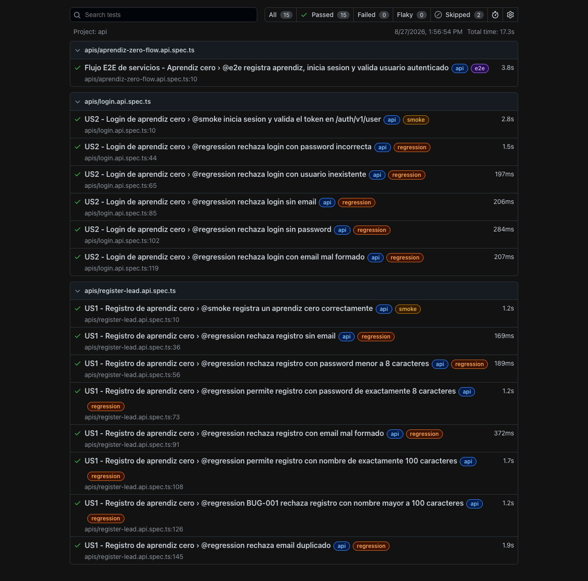
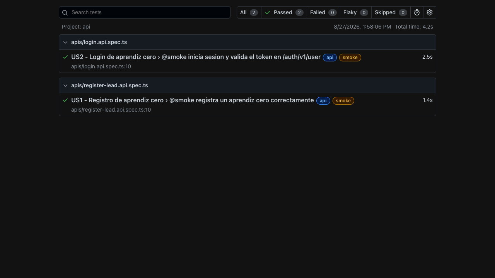
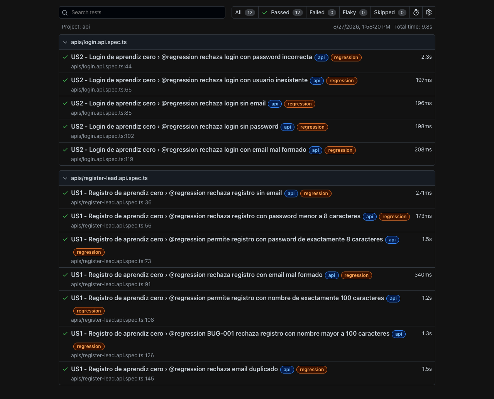
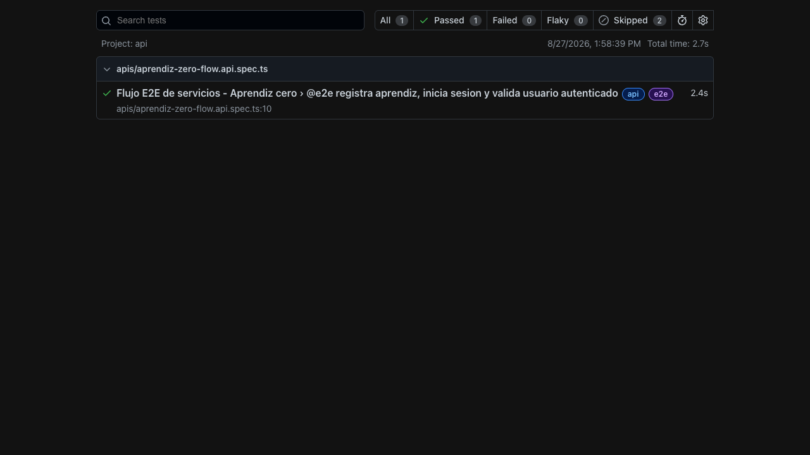

# qax-zero - API Testing Aprendiz Cero

Proyecto de API Testing para validar el flujo de **aprendiz cero** usando **Supabase API + Playwright + TypeScript**.

Este proyecto cubre las historias:

- US1 - Registro de aprendiz cero.
- US2 - Login de aprendiz cero.
- Flujo e2e de servicios: registro -> login -> usuario autenticado.

La automatización se construyó con una estructura sencilla para que la QA pueda entender qué hace cada parte del proyecto.

## API Bajo Prueba

Base URL:

```text
https://zjlscomkvdbspkuudled.supabase.co
```

Autenticación usada por los servicios:

```text
apikey: SUPABASE_ANON_KEY
Authorization: Bearer SUPABASE_ANON_KEY
```

Variables usadas:

```text
API_BASE_URL=https://zjlscomkvdbspkuudled.supabase.co
SUPABASE_ANON_KEY=anon_key_tomada_desde_el_navegador
TEST_EMAIL_DOMAIN=test.test
EXISTING_USER_EMAIL=email_existente
EXISTING_USER_PASSWORD=password_existente
```

El valor real de `SUPABASE_ANON_KEY` no se sube al repositorio. Se toma desde el navegador cuando se ingresa al sitio de staging y se revisan los requests en DevTools.

## Arquitectura

```text
qax-zero/
├── docs/
│   ├── bugs.md
│   ├── risk-matrix.md
│   ├── test-design.md
│   └── test-strategy.md
├── evidence/
│   ├── image_total.png
│   ├── image_smoke.png
│   ├── image_regression.png
│   └── image_e2e.png
├── postman/
│   ├── README.md
│   └── collection.api.json
├── src/
│   ├── builders/
│   │   └── lead.builder.ts
│   ├── helpers/
│   │   ├── api.helper.ts
│   │   ├── env.helper.ts
│   │   ├── lead-flow.helper.ts
│   │   ├── logger.helper.ts
│   │   └── response.helper.ts
│   ├── services/
│   │   ├── auth.service.ts
│   │   └── register-lead.service.ts
│   └── types/
│       ├── auth.types.ts
│       └── register-lead.types.ts
├── tests/
│   └── apis/
│       ├── aprendiz-zero-flow.api.spec.ts
│       ├── login.api.spec.ts
│       └── register-lead.api.spec.ts
├── .env.example
├── playwright.config.ts
├── tsconfig.json
└── package.json
```

## Qué Hace Cada Carpeta

| Carpeta | Uso |
|---|---|
| `docs/` | Guarda el diseño de pruebas, estrategia, matriz de riesgos y bugs encontrados. |
| `evidence/` | Guarda las capturas de los resultados de las ejecuciones. |
| `postman/` | Guarda la colección manual para importar en Postman. |
| `src/builders/` | Prepara datos de prueba, como el aprendiz nuevo para registro. |
| `src/helpers/` | Guarda funciones pequeñas que se reutilizan en varios tests. |
| `src/services/` | Hace las llamadas a los endpoints. |
| `src/types/` | Define la forma esperada de los requests y responses. |
| `tests/apis/` | Contiene los tests automatizados de servicios. |

## Instalación

1. Instalar dependencias:

```bash
npm install
```

2. Crear el archivo de ambiente usando `.env.example` como guía:

```bash
cp .env.example .env.stg
```

3. Completar los valores reales en `.env.stg`:

```text
API_BASE_URL=https://zjlscomkvdbspkuudled.supabase.co
SUPABASE_ANON_KEY=valor_real
TEST_EMAIL_DOMAIN=test.test
EXISTING_USER_EMAIL=email_real_si_se_necesita
EXISTING_USER_PASSWORD=password_real_si_se_necesita
```

El archivo `.env.stg` no se debe subir al repositorio porque contiene información local del ambiente.

## Comandos

Validar TypeScript:

```bash
npm run typecheck
```

Ejecutar toda la suite:

```bash
npm test
```

Ejecutar solo API:

```bash
npm run test:api
```

Ejecutar smoke:

```bash
npm run test:smoke
```

Ejecutar regression:

```bash
npm run test:regression
```

Ejecutar e2e:

```bash
npm run test:e2e
```

Abrir reporte HTML:

```bash
npm run report
```

También se pueden usar los comandos directos:

```bash
npx playwright test --grep @smoke
npx playwright test --grep @regression
npx playwright test --grep @e2e
```

## Módulos y Endpoints Cubiertos

| Historia | Módulo | Método | Endpoint |
|---|---|---:|---|
| US1 | Registro | POST | `/functions/v1/register-lead` |
| US2 | Login | POST | `/auth/v1/token?grant_type=password` |
| US2 | Usuario autenticado | GET | `/auth/v1/user` |

## Tests Implementados

| Archivo | Caso | Tag |
|---|---|---|
| `register-lead.api.spec.ts` | Registro exitoso de aprendiz cero | `@smoke` |
| `register-lead.api.spec.ts` | Rechaza registro sin email | `@regression` |
| `register-lead.api.spec.ts` | Rechaza password menor a 8 caracteres | `@regression` |
| `register-lead.api.spec.ts` | Permite password de exactamente 8 caracteres | `@regression` |
| `register-lead.api.spec.ts` | Rechaza email mal formado | `@regression` |
| `register-lead.api.spec.ts` | Permite nombre de exactamente 100 caracteres | `@regression` |
| `register-lead.api.spec.ts` | BUG-001: nombre mayor a 100 caracteres | `@regression` |
| `register-lead.api.spec.ts` | Rechaza email duplicado | `@regression` |
| `login.api.spec.ts` | Login exitoso y validación del token en `/auth/v1/user` | `@smoke` |
| `login.api.spec.ts` | Rechaza login con password incorrecta | `@regression` |
| `login.api.spec.ts` | Rechaza login con usuario inexistente | `@regression` |
| `login.api.spec.ts` | Rechaza login sin email | `@regression` |
| `login.api.spec.ts` | Rechaza login sin password | `@regression` |
| `login.api.spec.ts` | Rechaza login con email mal formado | `@regression` |
| `aprendiz-zero-flow.api.spec.ts` | Registro -> login -> usuario autenticado | `@e2e` |
| `aprendiz-zero-flow.api.spec.ts` | BUG-002: validar email de bienvenida | `test.fixme @e2e` |
| `aprendiz-zero-flow.api.spec.ts` | Validar redirección web a onboarding | `test.fixme @e2e` |

## Tags Usados

El proyecto usa solo estos tags:

| Tag | Uso |
|---|---|
| `@smoke` | Casos principales que confirman que registro y login funcionan. |
| `@regression` | Validaciones de reglas de negocio y escenarios negativos. |
| `@e2e` | Flujo completo de servicios. |

## Casos de Prueba en Gherkin

### Feature: Registro de aprendiz cero

```gherkin
@smoke
Scenario: Registro exitoso
  Given que el aprendiz no existe en el sistema
  When envia email, password y nombre completo validos
  Then el sistema crea el usuario
  And asigna acceso free
```

```gherkin
@regression
Scenario: Registro rechazado por datos invalidos
  Given que el aprendiz envia datos incompletos o invalidos
  When solicita el registro
  Then el sistema rechaza la operacion con un mensaje claro
```

```gherkin
@regression
Scenario: Registro rechazado por email duplicado
  Given que ya existe un aprendiz con el mismo email
  When intenta registrarse nuevamente
  Then el sistema rechaza el registro duplicado
```

### Feature: Login de aprendiz cero

```gherkin
@smoke
Scenario: Login exitoso
  Given que el aprendiz ya esta registrado
  When envia email y password validos
  Then el sistema devuelve access_token
  And el token permite consultar /auth/v1/user
```

```gherkin
@regression
Scenario: Login rechazado
  Given que el aprendiz envia credenciales incorrectas o incompletas
  When solicita login
  Then el sistema rechaza la sesion
```

### Feature: Flujo e2e de servicios

```gherkin
@e2e
Scenario: Registro y login del aprendiz
  Given que se registra un aprendiz nuevo
  When inicia sesion con las mismas credenciales
  Then obtiene un access_token
  And /auth/v1/user confirma que es el mismo usuario
```

## Colección Postman

La colección está en:

```text
postman/collection.api.json
```

El README de Postman está en:

```text
postman/README.md
```

Variables que se deben configurar manualmente en Postman:

| Variable | Descripción |
|---|---|
| `base_url` | URL base de Supabase. |
| `supabase_anon_key` | Token anon de Supabase tomado desde el navegador. |
| `email` | Email que se usará para registrar o iniciar sesión. |
| `password` | Password del aprendiz. |
| `full_name` | Nombre del aprendiz. |
| `access_token` | Token devuelto por login para consultar `/auth/v1/user`. |

La colección no tiene scripts. Solo deja las URLs, headers y body necesarios para ejecutar manualmente.

## Evidencias

Las evidencias quedaron en la carpeta:

```text
evidence/
```

Capturas disponibles:






## Resultados de Ejecución

Última ejecución realizada:

| Ejecución | Resultado |
|---|---|
| Total | 15 passed, 2 skipped |
| Smoke | 2 passed |
| Regression | 12 passed |
| E2E | 1 passed, 2 skipped |

Los `skipped` corresponden a escenarios marcados con `test.fixme`.

## Bugs Encontrados

### BUG-001 - Registro permite nombre mayor a 100 caracteres

El criterio de aceptación indica que `full_name` debe aceptar máximo 100 caracteres.

Resultado actual: el servicio acepta 101 caracteres y responde `200`.

El test queda marcado con `test.fail` para documentar el bug sin romper la suite completa.

### BUG-002 - No llega email de bienvenida

La historia pide validar que llegue un correo desde `alertas@qaxpert.com` con el asunto esperado.

Se hizo la prueba manual y el correo no llega.

Por eso este caso se descarta de la automatización hasta que la funcionalidad esté operativa. El escenario queda marcado con `test.fixme`.

## Pendiente Manual

- Validar el contenido real del email de bienvenida cuando se corrija BUG-002.
- Validar remitente y asunto del email cuando la funcionalidad esté operativa.
- Validar redirección web a onboarding.
- Validar la bienvenida con el nombre del aprendiz en pantalla.
- Validar el detalle completo del free trial fuera de la respuesta inicial.

## Notas Importantes

- Los tests crean aprendices reales en el ambiente de staging.
- Cada registro usa un email dinámico para evitar duplicados accidentales.
- El `access_token` de login se usa solo durante la ejecución del test.
- No se deben subir `.env`, `.env.stg`, tokens ni passwords reales.
- La carpeta `evidence/` queda en la raíz de `qax-zero`.
